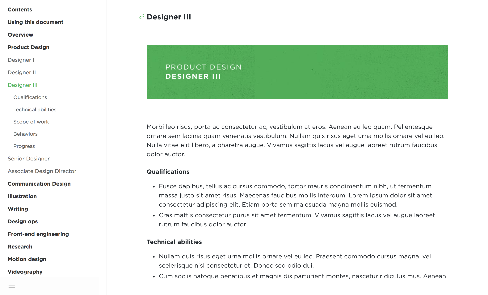

# Open Source Design Ladder



Sequoia Creative Lab's open source career ladder guide. Sed posuere consectetur est at lobortis. Cras mattis consectetur purus sit amet fermentum. Maecenas faucibus mollis interdum. Vivamus sagittis lacus vel augue laoreet rutrum faucibus dolor auctor.

## Framework

The career ladder uses [Docute.js](https://docute.js.org/#/home), built on [Vue.js](https://vuejs.org/), to build out the career ladder documentation style.

Docute allows us to
- Automatically build out the table of contents in the sidebar
- Track scroll depth and highlight corresponding section in the sidebar.
- Create anchor links for each heading.
- Handle basic scroll animations.
- Set up a separate landing page.

The content of the site lives in the `readme.md` markdown file in the `docs` folder. For tips on writing markdown, check out this [markdown cheatsheet](https://github.com/adam-p/markdown-here/wiki/Markdown-Cheatsheet).

### Quick Start

```bash
npm i -g docute-cli
```

### Clone the repo

```
git clone git@github.com:sequoiacreativelab/career-ladder.git
```

### Open the docs folder of the repo

```
cd career-ladder/docs
```

### Run docute

```
docute ./docs
```

Open `http://localhost:8080/#/` on your browser.

## Configuration

`docute.init` (found in the index.html file) accepts an argument for setting configurations:

```js
docute.init({
  // ...config goes here
})
```

### Landing page

The `landing` page is set as an object in the config:

```js
docute.init({
  landing: {
    source: 'landing.html'
  }
})
```


## Deploy to GitHub

There are three places to populate your docs:

- `./docs` folder
- master branch
- gh-pages branch

Just select it in repo's settings page after pushed files:


